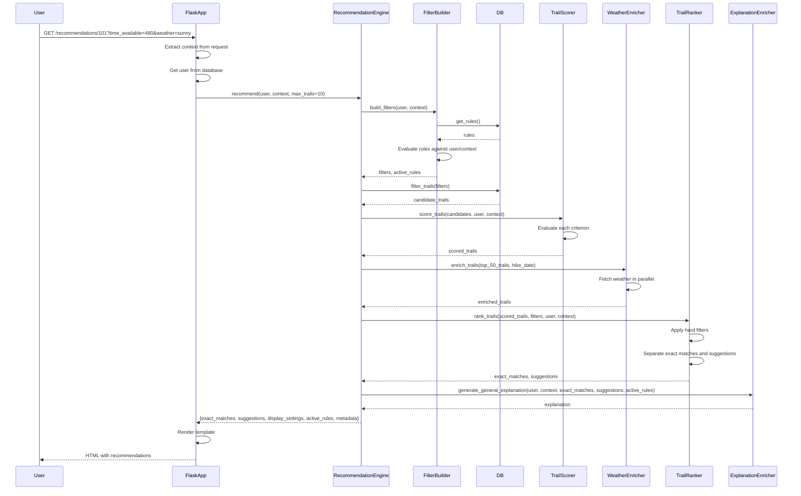
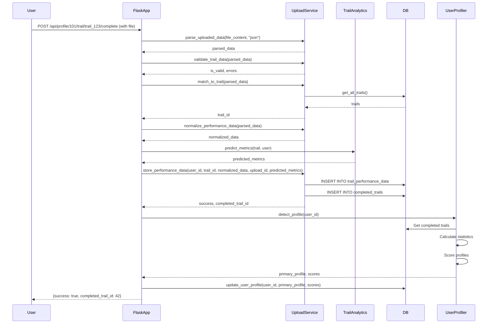
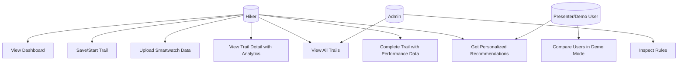
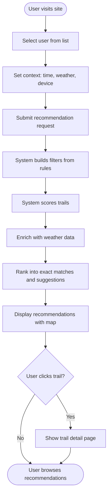
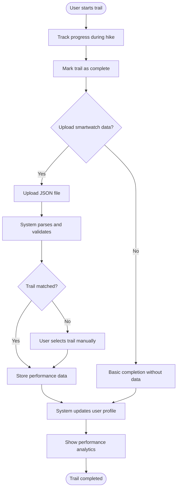
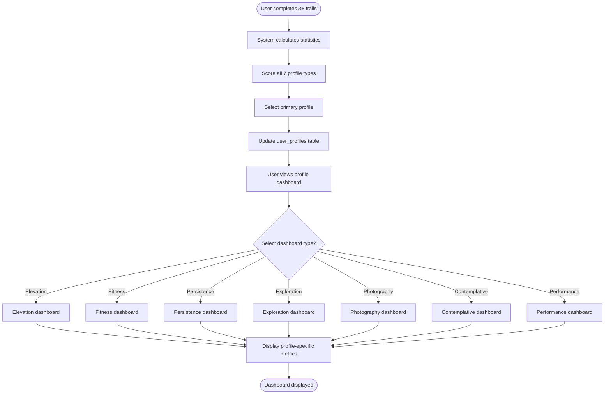
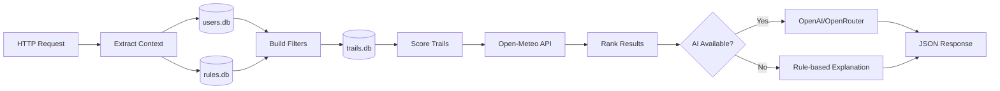

# Functional Documentation

## Features Overview

The Adaptive Trail Recommender provides the following core features:

### 1. Context-Aware Trail Recommendations
- Personalized recommendations based on user profile, available time, device, weather, season, and connection quality
- Progressive fallback system ensures results even with strict filters
- Real-time weather integration for trail safety

### 2. User Profile Detection
- Automatic profile classification from trail completion history
- Seven profile types: Elevation Enthusiast, Performance Athlete, Contemplative, Casual, Family, Explorer, Photographer
- Profile scores updated after each trail completion

### 3. Trail Management
- Save trails for later
- Start trails and track progress
- Complete trails with ratings, difficulty assessment, and photos
- Upload smartwatch performance data (JSON format)

### 4. Performance Analytics
- Time-series performance data visualization
- Heart rate, speed, elevation, and calorie analysis
- Predicted vs actual metrics comparison
- Performance trends and improvements tracking

### 5. Interactive Maps and Visualizations
- Leaflet-based trail maps with GPS traces
- Elevation profiles with Chart.js
- Weather forecast overlays
- Multi-view support (map, cards, list)

### 6. Demo Mode
- Side-by-side user comparison
- Context scenario testing
- Rule activation visualization
- Presentation-ready interface

### 7. Dashboard System
- Profile-specific dashboards (elevation, fitness, persistence, exploration, photography, contemplative, performance)
- Metrics and charts for each profile type
- Historical trend analysis

## Use Cases

### UC-1: Get Personalized Recommendations
**Actor**: Hiker  
**Preconditions**: User exists in system, trails database populated  
**Main Flow**:
1. User navigates to recommendations page with user ID
2. System extracts context (time available, device, weather, season)
3. System builds filters from rules and user profile
4. System scores all candidate trails
5. System enriches top trails with weather forecasts
6. System ranks trails into exact matches and suggestions
7. System generates explanations
8. User sees personalized trail list with map and cards

**Alternative Flows**:
- No exact matches: System uses progressive fallback to relax filters
- Weather API unavailable: System continues without weather data
- AI explanations fail: System uses rule-based fallback explanations

### UC-2: Complete a Trail with Performance Data
**Actor**: Hiker  
**Preconditions**: User has started a trail  
**Main Flow**:
1. User uploads smartwatch JSON file
2. System parses and validates data
3. System matches data to trail (by ID, name, or coordinates)
4. System normalizes performance data
5. System stores time-series data
6. System calculates predicted metrics
7. System creates completed_trail record
8. System updates user profile
9. User sees completion confirmation with analytics

### UC-3: View Trail Detail with Analytics
**Actor**: Hiker  
**Preconditions**: User has completed trail with performance data  
**Main Flow**:
1. User navigates to trail detail page
2. System loads trail geometry and elevation profile
3. System fetches performance data for completed trail
4. System loads weather forecast
5. System generates AI recommendations
6. User sees map, elevation chart, performance metrics, and recommendations

### UC-4: Compare Users in Demo Mode
**Actor**: Presenter/Demo User  
**Preconditions**: Multiple users exist in system  
**Main Flow**:
1. User selects two users for comparison
2. User sets context parameters for each user
3. System generates recommendations for both users
4. System displays side-by-side results
5. User can see differences in recommendations based on profiles

### UC-5: Upload and Process Smartwatch Data
**Actor**: Hiker  
**Preconditions**: User has completed a trail  
**Main Flow**:
1. User uploads JSON file from smartwatch
2. System validates file format
3. System attempts to match trail automatically
4. If matched, system stores data immediately
5. If not matched, user selects trail manually
6. System processes and stores performance data
7. System updates user profile

## User Profiles

The system detects seven distinct user profiles based on trail completion patterns:

### Elevation Enthusiast (L''Amateur de dénivelé)
- **Characteristics**: Prefers high elevation gain (>700m), challenging difficulty (>6.5)
- **Trail preferences**: Steep ascents, peak views, high elevation gain per km
- **Dashboard**: Elevation metrics, peak achievements, elevation gain trends

### Performance Athlete (Le Sportif de performance)
- **Characteristics**: Long distances (>10km), consistent training, loop trails preferred
- **Trail preferences**: Endurance trails, consistent difficulty, training-friendly routes
- **Dashboard**: Fitness metrics, heart rate zones, training consistency

### Contemplative Hiker (Le Contemplatif)
- **Characteristics**: Scenic landscapes (lakes, peaks), moderate popularity (6.5-7.5)
- **Trail preferences**: Beautiful views, peaceful settings, moderate difficulty
- **Dashboard**: Scenic beauty score, average time spent, landscape preferences

### Casual Hiker (Le Randonneur occasionnel)
- **Characteristics**: Short trails (<5km), easy difficulty (<4.0), safe routes
- **Trail preferences**: Easy access, low elevation, family-friendly
- **Dashboard**: Basic completion stats, preferred difficulty range

### Family/Group Hiker (La Famille / Groupe)
- **Characteristics**: Very easy difficulty (<4.0), high safety (no risks), landscape variety
- **Trail preferences**: Safe, easy, varied landscapes, suitable for all ages
- **Dashboard**: Safety metrics, family-friendly trail recommendations

### Explorer/Adventurer (L''Explorateur / Aventurier)
- **Characteristics**: Low popularity (<7.0), rare landscapes (glacier, alpine), risk acceptance
- **Trail preferences**: Less-traveled routes, unique landscapes, some risk tolerance
- **Dashboard**: Exploration metrics, unique regions visited, trail diversity

### Photographer/Content Creator (Le Photographe)
- **Characteristics**: Scenic landscapes (lakes, peaks), one-way trails, flexible duration (60-240 min)
- **Trail preferences**: Photo opportunities, scenic viewpoints, uninterrupted routes
- **Dashboard**: Scenic trails count, photography-focused recommendations

## UML Class Diagrams

### Core Recommendation Engine Classes

```mermaid
classDiagram
    class RecommendationEngine {
        -FilterBuilder filter_builder
        -TrailScorer scorer
        -TrailRanker ranker
        -WeatherEnricher weather_enricher
        -ExplanationEnricher explanation_enricher
        -RecommendationDebugger debugger
        +recommend(user, context, max_trails) Dict
    }
    
    class FilterBuilder {
        -List~Dict~ rules
        +build_filters(user, context, debugger) Tuple
        -_evaluate_condition(condition, user, context) bool
        -_apply_adaptation(filters, adaptation) void
    }
    
    class TrailScorer {
        -List~Criterion~ criteria
        +score_trail(trail, user, context) Dict
        +score_trails(trails, user, context) List~Dict~
    }
    
    class TrailRanker {
        -float exact_match_threshold
        +rank_trails(trails, filters, user, context, debugger) Tuple
        -_apply_hard_filters(trails, filters, user, context) List~Dict~
        -_is_exact_match(trail, filters, user, context, relevance) bool
    }
    
    class WeatherEnricher {
        -Dict cache
        -int max_workers
        +enrich_trails(trails, hike_date, max_trails) List~Dict~
    }
    
    class ExplanationEnricher {
        -ExplanationService explanation_service
        -ContextBuilder context_builder
        -OrderedDict cache
        +generate_general_explanation(user, context, exact_matches, suggestions, active_rules) Dict
        +generate_trail_explanation(trail, user, context, matched_criteria, unmatched_criteria) Dict
    }
    
    class Criterion {
        <<abstract>>
        +float weight
        +evaluate(trail, user, context)* CriterionResult
        +get_name()* str
    }
    
    class CriterionResult {
        +bool matches
        +float score
        +str message
        +float weight
    }
    
    class DifficultyCriterion {
        +evaluate(trail, user, context) CriterionResult
    }
    
    class DurationCriterion {
        +evaluate(trail, user, context) CriterionResult
    }
    
    RecommendationEngine --> FilterBuilder
    RecommendationEngine --> TrailScorer
    RecommendationEngine --> TrailRanker
    RecommendationEngine --> WeatherEnricher
    RecommendationEngine --> ExplanationEnricher
    TrailScorer --> Criterion
    DifficultyCriterion --|> Criterion
    DurationCriterion --|> Criterion
    TrailScorer --> CriterionResult
```



### Backend Services Classes

```mermaid
classDiagram
    class TrailManagement {
        +save_trail(user_id, trail_id, notes) bool
        +unsave_trail(user_id, trail_id) bool
        +start_trail(user_id, trail_id) bool
        +update_trail_progress(user_id, trail_id, position, progress_percentage, pause_points) bool
        +complete_started_trail(user_id, trail_id, actual_duration, rating, difficulty_rating, photos, uploaded_file_id) Tuple
        +get_user_trails(user_id) Dict
    }
    
    class UploadService {
        +parse_uploaded_data(file_content, data_format) Dict
        +validate_trail_data(parsed_data) Tuple
        +match_to_trail(uploaded_data) str
        +normalize_performance_data(parsed_data) Dict
        +store_performance_data(user_id, trail_id, normalized_data, uploaded_data_id, predicted_metrics) Tuple
    }
    
    class TrailAnalytics {
        +analyze_trail_performance(completed_trail_id) Dict
        +predict_metrics(trail, user, weather, target_date) Dict
    }
    
    class DashboardCalculator {
        +calculate_elevation_metrics(user_id) Dict
        +calculate_fitness_metrics(user_id) Dict
        +calculate_persistence_metrics(user_id) Dict
        +calculate_exploration_metrics(user_id) Dict
        +calculate_photography_metrics(user_id) Dict
        +calculate_contemplative_metrics(user_id) Dict
        +calculate_performance_metrics(user_id) Dict
        +calculate_heart_rate_trends(user_id) Dict
        +calculate_gps_aggregates(user_id) Dict
        +calculate_performance_improvements(user_id) Dict
    }
    
    class UserProfiler {
        +calculate_statistics(user_id) Dict
        +detect_profile(user_id) Tuple
        -_score_profiles(stats) Dict
    }
    
    class WeatherService {
        +get_weather_forecast(latitude, longitude, target_date) str
        +get_weather_for_trail(trail, target_date) str
        +get_weekly_forecast(latitude, longitude, start_date) List~Dict~
        +get_weather_recommendations(trail, forecast) Dict
    }
    
    class ExplanationService {
        -OpenAI client
        -str model
        -bool use_openrouter
        +generate_explanation(prompt) Dict
        +generate_fallback_explanation(matched_criteria) Dict
    }
    
    class TrailRecommendationService {
        -ExplanationService explanation_service
        -TrailAnalytics analytics
        +generate_trail_recommendations(trail, user, weather_forecast) Dict
    }
```



## Sequence Diagrams

### Recommendation Generation Flow



### Trail Completion with Upload Flow



## Use Case Diagram



## User Workflows

### Workflow 1: First-Time User Getting Recommendations



### Workflow 2: Completing a Trail with Performance Data



### Workflow 3: Profile Detection and Dashboard



## Feature Matrix

| Feature | Description | User Type | API Endpoint |
| --- | --- | --- | --- |
| Get Recommendations | Personalized trail suggestions | All | `/recommendations/<user_id>` |
| Save Trail | Bookmark trail for later | All | `POST /api/profile/<user_id>/trails/save` |
| Start Trail | Begin tracking a trail | All | `POST /api/profile/<user_id>/trails/start` |
| Complete Trail | Mark trail as completed | All | `POST /api/profile/<user_id>/trails/<trail_id>/complete` |
| Upload Performance Data | Upload smartwatch JSON | All | `POST /api/profile/<user_id>/upload` |
| View Trail Detail | Detailed trail view with map | All | `/trail/<user_id>/<trail_id>` |
| View Profile Dashboard | Profile-specific metrics | All | `/profile/<user_id>` |
| Compare Users | Side-by-side comparison | Demo | `/demo` |
| View All Trails | Browse all available trails | All | `/trails` |
| Get Analytics | Performance analysis | All | `GET /api/profile/<user_id>/trail/<trail_id>/analytics` |
| Get Predictions | Predicted metrics | All | `GET /api/profile/<user_id>/trail/<trail_id>/predictions` |
| Get AI Recommendations | Profile-specific tips | All | `GET /api/profile/<user_id>/trail/<trail_id>/recommendations` |

## Data Flow Diagrams

### Recommendation Request Data Flow



## Business Rules

### Rule Evaluation Logic
- Rules are evaluated using AND logic (all conditions must match)
- Conditions support: equality (`=`), comparison (`<=`, `>=`), and containment (`CONTAINS`)
- Adaptations modify filters (max_difficulty, max_distance, display_mode, etc.)
- Rules can reference: user attributes, context values, and performance metrics

### Scoring Logic
- Each criterion has a weight (1.0 to 2.5)
- Criteria scores are weighted and aggregated
- Relevance percentage = (weighted_sum / total_weight) * 100
- Exact match threshold: 80% (configurable)

### Profile Detection Logic
- Requires minimum 3 completed trails
- Scores all 7 profiles based on statistics
- Selects profile with highest score
- Tie-breaking uses priority order: elevation_lover > performance_athlete > explorer > photographer > contemplative > family > casual

## Database Schema

### Entity Relationship Diagram

```mermaid
erDiagram
    users ||--o{ preferences : has
    users ||--o| performance : has
    users ||--o{ completed_trails : completes
    users ||--o| user_profiles : has
    users ||--o{ saved_trails : saves
    users ||--o{ started_trails : starts
    users ||--o{ uploaded_trail_data : uploads
    
    completed_trails ||--o{ trail_performance_data : contains
    completed_trails ||--o{ trail_photos : has
    completed_trails }o--|| uploaded_trail_data : "may reference"
    
    users {
        int id PK
        string name
        string experience
        string fitness_level
        int fear_of_heights
        string health_constraints
    }
    
    preferences {
        int id PK
        int user_id FK
        string preference
    }
    
    performance {
        int user_id PK_FK
        int trails_completed
        float avg_difficulty_completed
        float persistence_score
        float exploration_level
        float avg_completion_time
        int activity_frequency
    }
    
    completed_trails {
        int id PK
        int user_id FK
        string trail_id
        string completion_date
        int actual_duration
        int rating
        int avg_heart_rate
        int max_heart_rate
        float avg_speed
        float max_speed
        int total_calories
        int uploaded_data_id FK
        int difficulty_rating
        int predicted_duration
        int predicted_avg_heart_rate
        int predicted_max_heart_rate
        float predicted_avg_speed
        float predicted_max_speed
        int predicted_calories
        string predicted_profile_category
    }
    
    trail_performance_data {
        int id PK
        int completed_trail_id FK
        int timestamp
        int heart_rate
        float speed
        float elevation
        int calories
        int cadence
        float latitude
        float longitude
    }
    
    saved_trails {
        int id PK
        int user_id FK
        string trail_id
        string saved_date
        string notes
    }
    
    started_trails {
        int id PK
        int user_id FK
        string trail_id
        string start_date
        float progress_percentage
        string last_position
        string pause_points
    }
    
    user_profiles {
        int user_id PK_FK
        string primary_profile
        string profile_scores
        string last_updated
        string pinned_dashboard
    }
    
    uploaded_trail_data {
        int id PK
        int user_id FK
        string filename
        string file_content
        string data_format
        string status
        string trail_id
        string parsed_data
    }
    
    trail_photos {
        int id PK
        int completed_trail_id FK
        string photo_path
        string caption
        string upload_date
    }
```

### Key Relationships
- **users** → **completed_trails**: One-to-many (user can complete multiple trails)
- **completed_trails** → **trail_performance_data**: One-to-many (time-series data points)
- **users** → **saved_trails**: One-to-many (user can save multiple trails)
- **users** → **started_trails**: One-to-many (user can start multiple trails)
- **completed_trails** → **uploaded_trail_data**: Optional one-to-one (may reference upload)

## See also
- Architecture: `docs/architecture.md`
- Backend implementation: `docs/backend.md`
- Recommendation engine: `docs/recommendation_engine.md`
- Operations: `docs/operations.md`
- Data pipeline: `docs/data_pipeline.md`
