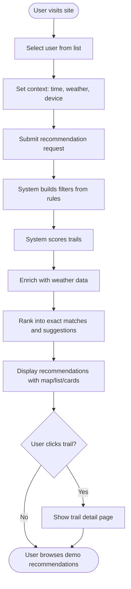

# Functional Documentation

## Features Overview

The Adaptive Trail Recommender provides the following core features:

### 1. Context-Aware Trail Recommendations
- Personalized recommendations based on user profile, available time, device, weather, season, and connection quality
- Progressive fallback system ensures results even with strict filters
- Real-time weather integration for trail safety
- Collaborative recommendations from similar users (same profile) who have completed and rated trails highly

### 2. User Profile Detection
- Automatic profile classification from trail completion history
- Seven profile types: Elevation Enthusiast, Performance Athlete, Contemplative, Casual, Family, Explorer, Photographer
- Profile scores updated after each trail completion

### 3. Trail Management
- Save trails for later
- Start trails and track progress
- Complete trails with ratings, difficulty assessment, and photos
- Upload smartwatch performance data (JSON format)

### 4. Performance Analytics
- Time-series performance data visualization
- Heart rate, speed, elevation, and calorie analysis
- Predicted vs actual metrics comparison
- Performance trends and improvements tracking

### 5. Interactive Maps and Visualizations
- Leaflet-based trail maps with GPS traces
- Elevation profiles with Chart.js
- Weather forecast overlays
- Multi-view support (map, cards, list)

### 6. Demo Mode
- Side-by-side user comparison
- Context scenario testing
- Rule activation visualization
- Presentation-ready interface

### 7. Dashboard System
- Profile-specific dashboards (elevation, fitness, persistence, exploration, photography, contemplative, performance)
- Metrics and charts for each profile type
- Historical trend analysis

### 8. Collaborative Recommendations
- Recommends trails based on what similar users (same profile) have completed and rated highly
- Filters trails by minimum rating threshold (default: 3.5/5) and minimum user count (default: 2 users)
- Displays collaborative metadata: average rating, number of users, completion count
- Integrates with main recommendation pipeline - trails can appear in exact/suggestions with collaborative markers, or in dedicated collaborative section
- Visual indicators: collaborative icons, badges, special map markers with dashed rings

## Use Cases

### UC-1: Get Personalized Recommendations
**Actor**: Hiker  
**Preconditions**: User exists in system, trails database populated  
**Main Flow**:
1. User navigates to demo page and selects a user
2. User sets context parameters (time available, device, weather, season)
3. System extracts context and builds filters from rules and user profile
4. System scores all candidate trails
5. System enriches top trails with weather forecasts
6. System ranks trails into exact matches and suggestions
7. System retrieves collaborative recommendations from similar users (same profile)
8. System marks trails that appear in both main recommendations and collaborative results
9. System generates explanations
10. User sees personalized trail list with map, list, and card views, including:
    - Exact matches (with collaborative markers if applicable)
    - Suggestions (with collaborative markers if applicable)
    - Dedicated "Popular with Similar Hikers" section with collaborative-only trails

**Alternative Flows**:
- No exact matches: System uses progressive fallback to relax filters
- Weather API unavailable: System continues without weather data
- AI explanations fail: System uses rule-based fallback explanations
- No collaborative recommendations: User has no profile or no similar users have completed trails - collaborative section is hidden

### UC-2: Complete a Trail with Performance Data
**Actor**: Hiker  
**Preconditions**: User has started a trail  
**Main Flow**:
1. User uploads smartwatch JSON file
2. System parses and validates data
3. System matches data to trail (by ID, name, or coordinates)
4. System normalizes performance data
5. System stores time-series data
6. System calculates predicted metrics
7. System creates completed_trail record
8. System updates user profile
9. User sees completion confirmation with analytics

### UC-3: View Trail Detail with Analytics
**Actor**: Hiker  
**Preconditions**: User has completed trail with performance data  
**Main Flow**:
1. User navigates to trail detail page
2. System loads trail geometry and elevation profile
3. System fetches performance data for completed trail
4. System loads weather forecast
5. System generates AI recommendations with similar-profile hiker context (see Trail Recommendations below)
6. **System adaptively orders navigation tabs based on user profile** (see Adaptive Navigation below)
7. User sees map, elevation chart, performance metrics, and concise recommendations
8. Navigation tabs are sticky and scroll to sections on click

### UC-4: Compare Users in Demo Mode
**Actor**: Presenter/Demo User  
**Preconditions**: Multiple users exist in system  
**Main Flow**:
1. User selects two users for comparison
2. User sets context parameters for each user
3. System generates recommendations for both users
4. System displays side-by-side results
5. User can see differences in recommendations based on profiles

### UC-5: Upload and Process Smartwatch Data
**Actor**: Hiker  
**Preconditions**: User has completed a trail  
**Main Flow**:
1. User uploads JSON file from smartwatch
2. System validates file format
3. System attempts to match trail automatically
4. If matched, system stores data immediately
5. If not matched, user selects trail manually
6. System processes and stores performance data
7. System updates user profile

### UC-6: View Collaborative Recommendations
**Actor**: Hiker  
**Preconditions**: User has a detected profile, other users with same profile have completed trails  
**Main Flow**:
1. User navigates to demo page or recommendations page
2. System retrieves user's profile from database
3. System queries for trails completed by users with same profile
4. System filters trails by minimum rating (default: 3.5/5) and minimum user count (default: 2)
5. System excludes trails already completed by current user
6. System enriches collaborative trails with metadata (average rating, user count)
7. System integrates collaborative trails with main recommendations:
   - Trails in exact/suggestions that are also collaborative → marked with collaborative indicators
   - Top 5 collaborative trails not in exact/suggestions → added to suggestions with collaborative markers
   - Remaining collaborative trails → displayed in dedicated "Popular with Similar Hikers" section
8. User sees collaborative recommendations with badges showing ratings and user counts
9. User can view collaborative trails on map with special markers (dashed rings)

**Alternative Flows**:
- User has no profile: No collaborative recommendations shown
- No similar users: No collaborative recommendations shown
- All collaborative trails already in exact/suggestions: Dedicated section may be empty, but trails show collaborative markers

## Adaptive Navigation Behavior

The trail detail page (`profile_trail_detail.html`) features adaptive navigation that reorders tab items based on the user's detected profile type. This ensures the most relevant information is prioritized for each user type.

### Navigation Tab Ordering Rules

**Base Rule**: Activity Overview is always the first tab, regardless of profile.

**Profile-Specific Ordering**:

| Profile Type | Tab Order |
|--------------|-----------|
| **Performance Athlete** | Overview → Performance → Route → Weather → Recommendations |
| **Elevation Lover** | Overview → Route → Weather → Performance → Recommendations |
| **Photographer** | Overview → Weather → Recommendations → Route → Performance |
| **Contemplative** | Overview → Recommendations → Weather → Route → Performance |
| **Explorer** | Overview → Route → Recommendations → Weather → Performance |
| **Casual/Family** | Overview → Weather → Recommendations → Route → Performance |
| **Default** (no profile detected) | Overview → Route → Weather → Performance → Recommendations |

### Implementation Details

- Navigation bar is positioned sticky below the app header
- Tab order is determined at page load based on `userProfile.primary_profile`
- Active tab highlighting uses `IntersectionObserver` to detect visible sections
- Clicking tabs smoothly scrolls to the corresponding section
- Tab reordering happens in the DOM without page reload

### Rationale

Each profile type has different information priorities:
- **Performance Athletes** need performance metrics first
- **Elevation Lovers** prioritize route details (elevation profiles)
- **Photographers** need weather and recommendations for planning
- **Contemplative** users value recommendations and weather conditions
- **Explorers** want route details and recommendations

## Trail Recommendations System

The trail detail page includes an enhanced AI-powered recommendations system that provides personalized, actionable advice based on the user's profile and insights from similar-profile hikers.

### Features

1. **Similar-Profile Hiker Context**: The system queries the database for other hikers with the same profile type who have completed the same trail, providing:
   - Average completion times (compared to trail estimates)
   - Average ratings from similar hikers
   - Performance metrics (heart rate, speed) from similar profiles
   - Difficulty perceptions vs. trail estimates
   - Key insights and observations

2. **Concise Format**: Recommendations are formatted for clarity:
   - Brief 1-2 sentence summary (max 50 words)
   - 3-4 most important actionable tips (max 80 characters each)
   - Clean, scannable UI with responsive grid layout
   - No redundant information or verbose sections

3. **Profile-Specific Focus**: Recommendations are tailored to each profile type:
   - **Elevation Lovers**: Peak timing, steepest sections, elevation challenges
   - **Photographers**: Photo opportunities, golden hour timing, scenic viewpoints
   - **Performance Athletes**: Pacing strategy, heart rate zones, training benefits
   - **Explorers**: Alternative routes, side trails, navigation tips
   - **Contemplative**: Quiet sections, solitude timing, peaceful viewpoints
   - **Casual/Family**: Difficulty assessment, pacing, safety considerations

### Implementation

The `TrailRecommendationService` class:
- Queries `completed_trails` and `user_profiles` tables to find similar-profile hikers
- Calculates statistics (averages, insights) from completion data
- Builds enhanced prompts with similar hiker context
- Generates concise AI explanations via `ExplanationService`
- Formats recommendations for optimal UI display

### UI Rendering

The recommendations section (`section-recommendations`) displays:
- **Summary Box**: Highlighted summary with left border accent
- **Tips Grid**: Responsive 2-3 column grid of compact tip cards
- **Hover Effects**: Interactive tip cards with visual feedback
- **Safety Section**: Distinct styling for important safety reminders (when applicable)

### Data Sources

Recommendations incorporate:
- Trail details (distance, elevation, difficulty, landscapes)
- User profile (experience, fitness, detected profile type)
- Weather forecasts and recommendations
- Similar-profile hiker statistics (completion times, ratings, performance metrics)
- Performance predictions from `TrailAnalytics`
- **Casual/Family** users prioritize safety (weather) and recommendations

## User Profiles

The system detects seven distinct user profiles based on trail completion patterns:

### Elevation Enthusiast (L''Amateur de dénivelé)
- **Characteristics**: Prefers high elevation gain (>700m), challenging difficulty (>6.5)
- **Trail preferences**: Steep ascents, peak views, high elevation gain per km
- **Dashboard**: Elevation metrics, peak achievements, elevation gain trends

### Performance Athlete (Le Sportif de performance)
- **Characteristics**: Long distances (>10km), consistent training, loop trails preferred
- **Trail preferences**: Endurance trails, consistent difficulty, training-friendly routes
- **Dashboard**: Fitness metrics, heart rate zones, training consistency

### Contemplative Hiker (Le Contemplatif)
- **Characteristics**: Scenic landscapes (lakes, peaks), moderate popularity (6.5-7.5)
- **Trail preferences**: Beautiful views, peaceful settings, moderate difficulty
- **Dashboard**: Scenic beauty score, average time spent, landscape preferences

### Casual Hiker (Le Randonneur occasionnel)
- **Characteristics**: Short trails (<5km), easy difficulty (<4.0), safe routes
- **Trail preferences**: Easy access, low elevation, family-friendly
- **Dashboard**: Basic completion stats, preferred difficulty range

### Family/Group Hiker (La Famille / Groupe)
- **Characteristics**: Very easy difficulty (<4.0), high safety (no risks), landscape variety
- **Trail preferences**: Safe, easy, varied landscapes, suitable for all ages
- **Dashboard**: Safety metrics, family-friendly trail recommendations

### Explorer/Adventurer (L''Explorateur / Aventurier)
- **Characteristics**: Low popularity (<7.0), rare landscapes (glacier, alpine), risk acceptance
- **Trail preferences**: Less-traveled routes, unique landscapes, some risk tolerance
- **Dashboard**: Exploration metrics, unique regions visited, trail diversity

### Photographer/Content Creator (Le Photographe)
- **Characteristics**: Scenic landscapes (lakes, peaks), one-way trails, flexible duration (60-240 min)
- **Trail preferences**: Photo opportunities, scenic viewpoints, uninterrupted routes
- **Dashboard**: Scenic trails count, photography-focused recommendations

## UML Class Diagrams

### Core Recommendation Engine Classes


### Backend Services Classes

```mermaid
classDiagram
    class TrailManagement {
        +save_trail(user_id, trail_id, notes) bool
        +unsave_trail(user_id, trail_id) bool
        +start_trail(user_id, trail_id) bool
        +update_trail_progress(user_id, trail_id, position, progress_percentage, pause_points) bool
        +complete_started_trail(user_id, trail_id, actual_duration, rating, difficulty_rating, photos, uploaded_file_id) Tuple
        +get_user_trails(user_id) Dict
    }
    
    class UploadService {
        +parse_uploaded_data(file_content, data_format) Dict
        +validate_trail_data(parsed_data) Tuple
        +match_to_trail(uploaded_data) str
        +normalize_performance_data(parsed_data) Dict
        +store_performance_data(user_id, trail_id, normalized_data, uploaded_data_id, predicted_metrics) Tuple
    }
    
    class TrailAnalytics {
        +analyze_trail_performance(completed_trail_id) Dict
        +predict_metrics(trail, user, weather, target_date) Dict
    }
    
    class DashboardCalculator {
        +calculate_elevation_metrics(user_id) Dict
        +calculate_fitness_metrics(user_id) Dict
        +calculate_persistence_metrics(user_id) Dict
        +calculate_exploration_metrics(user_id) Dict
        +calculate_photography_metrics(user_id) Dict
        +calculate_contemplative_metrics(user_id) Dict
        +calculate_performance_metrics(user_id) Dict
        +calculate_heart_rate_trends(user_id) Dict
        +calculate_gps_aggregates(user_id) Dict
        +calculate_performance_improvements(user_id) Dict
    }
    
    class UserProfiler {
        +calculate_statistics(user_id) Dict
        +detect_profile(user_id) Tuple
        -_score_profiles(stats) Dict
    }
    
    class WeatherService {
        +get_weather_forecast(latitude, longitude, target_date) str
        +get_weather_for_trail(trail, target_date) str
        +get_weekly_forecast(latitude, longitude, start_date) List~Dict~
        +get_weather_recommendations(trail, forecast) Dict
    }
    
    class ExplanationService {
        -OpenAI client
        -str model
        -bool use_openrouter
        +generate_explanation(prompt) Dict
        +generate_fallback_explanation(matched_criteria) Dict
    }
    
    class TrailRecommendationService {
        -ExplanationService explanation_service
        -TrailAnalytics analytics
        +generate_trail_recommendations(trail, user, weather_forecast) Dict
        -_get_similar_profile_context(trail, profile, current_user_id) Dict
        -_generate_ai_explanation(trail, user, profile, weather_recommendations, similar_hiker_context) Dict
        -_build_recommendation_prompt(trail, user, profile, weather_recommendations, similar_hiker_context) str
    }
    
    class CollaborativeRecommendationService {
        +get_trails_from_similar_users(user_id, min_rating, min_users, exclude_trail_ids) List~Dict~
    }
    
    CollaborativeRecommendationService --> "users.db"
    RecommendationEngine --> CollaborativeRecommendationService
```

## Sequence Diagrams

### Recommendation Generation Flow


### Trail Completion with Upload Flow


## Use Case Diagram


## User Workflows

### Workflow 1: First-Time User Getting Recommendations



### Workflow 2: Completing a Trail with Performance Data


### Workflow 3: Profile Detection and Dashboard


## Feature Matrix

| Feature | Description | User Type | API Endpoint |
| --- | --- | --- | --- |
| Get Recommendations | Personalized trail suggestions | All | `/demo` |
| Save Trail | Bookmark trail for later | All | `POST /api/profile/<user_id>/trails/save` |
| Start Trail | Begin tracking a trail | All | `POST /api/profile/<user_id>/trails/start` |
| Complete Trail | Mark trail as completed | All | `POST /api/profile/<user_id>/trails/<trail_id>/complete` |
| Upload Performance Data | Upload smartwatch JSON | All | `POST /api/profile/<user_id>/upload` |
| View Trail Detail | Detailed trail view with map | All | `/trail/<user_id>/<trail_id>` |
| View Profile Dashboard | Profile-specific metrics | All | `/profile/<user_id>` |
| Compare Users | Side-by-side comparison | Demo | `/demo` |
| View All Trails | Browse all available trails | All | `/trails` |
| Get Analytics | Performance analysis | All | `GET /api/profile/<user_id>/trail/<trail_id>/analytics` |
| Get Predictions | Predicted metrics | All | `GET /api/profile/<user_id>/trail/<trail_id>/predictions` |
| Get AI Recommendations | Profile-specific tips | All | `GET /api/profile/<user_id>/trail/<trail_id>/recommendations` |

## Data Flow Diagrams

### Recommendation Request Data Flow


## Business Rules

### Rule Evaluation Logic
- Rules are evaluated using AND logic (all conditions must match)
- Conditions support: equality (`=`), comparison (`<=`, `>=`), and containment (`CONTAINS`)
- Adaptations modify filters (max_difficulty, max_distance, display_mode, etc.)
- Rules can reference: user attributes, context values, and performance metrics

### Scoring Logic
- Each criterion has a weight (1.0 to 2.5)
- Criteria scores are weighted and aggregated
- Relevance percentage = (weighted_sum / total_weight) * 100
- Exact match threshold: 80% (configurable)

### Profile Detection Logic
- Requires minimum 3 completed trails
- Scores all 7 profiles based on statistics
- Selects profile with highest score
- Tie-breaking uses priority order: elevation_lover > performance_athlete > explorer > photographer > contemplative > family > casual

## Database Schema

### Entity Relationship Diagram

```mermaid
erDiagram
    users ||--o{ preferences : has
    users ||--o| performance : has
    users ||--o{ completed_trails : completes
    users ||--o| user_profiles : has
    users ||--o{ saved_trails : saves
    users ||--o{ started_trails : starts
    users ||--o{ uploaded_trail_data : uploads
    
    completed_trails ||--o{ trail_performance_data : contains
    completed_trails ||--o{ trail_photos : has
    completed_trails }o--|| uploaded_trail_data : "may reference"
    
    users {
        int id PK
        string name
        string experience
        string fitness_level
        int fear_of_heights
        string health_constraints
    }
    
    preferences {
        int id PK
        int user_id FK
        string preference
    }
    
    performance {
        int user_id PK_FK
        int trails_completed
        float avg_difficulty_completed
        float persistence_score
        float exploration_level
        float avg_completion_time
        int activity_frequency
    }
    
    completed_trails {
        int id PK
        int user_id FK
        string trail_id
        string completion_date
        int actual_duration
        int rating
        int avg_heart_rate
        int max_heart_rate
        float avg_speed
        float max_speed
        int total_calories
        int uploaded_data_id FK
        int difficulty_rating
        int predicted_duration
        int predicted_avg_heart_rate
        int predicted_max_heart_rate
        float predicted_avg_speed
        float predicted_max_speed
        int predicted_calories
        string predicted_profile_category
    }
    
    trail_performance_data {
        int id PK
        int completed_trail_id FK
        int timestamp
        int heart_rate
        float speed
        float elevation
        int calories
        int cadence
        float latitude
        float longitude
    }
    
    saved_trails {
        int id PK
        int user_id FK
        string trail_id
        string saved_date
        string notes
    }
    
    started_trails {
        int id PK
        int user_id FK
        string trail_id
        string start_date
        float progress_percentage
        string last_position
        string pause_points
    }
    
    user_profiles {
        int user_id PK_FK
        string primary_profile
        string profile_scores
        string last_updated
        string pinned_dashboard
    }
    
    uploaded_trail_data {
        int id PK
        int user_id FK
        string filename
        string file_content
        string data_format
        string status
        string trail_id
        string parsed_data
    }
    
    trail_photos {
        int id PK
        int completed_trail_id FK
        string photo_path
        string caption
        string upload_date
    }
```

### Key Relationships
- **users** → **completed_trails**: One-to-many (user can complete multiple trails)
- **completed_trails** → **trail_performance_data**: One-to-many (time-series data points)
- **users** → **saved_trails**: One-to-many (user can save multiple trails)
- **users** → **started_trails**: One-to-many (user can start multiple trails)
- **completed_trails** → **uploaded_trail_data**: Optional one-to-one (may reference upload)

## See also
- Architecture: `docs/architecture.md`
- Backend implementation: `docs/backend.md`
- Recommendation engine: `docs/recommendation_engine.md`
- Operations: `docs/operations.md`
- Data pipeline: `docs/data_pipeline.md`
